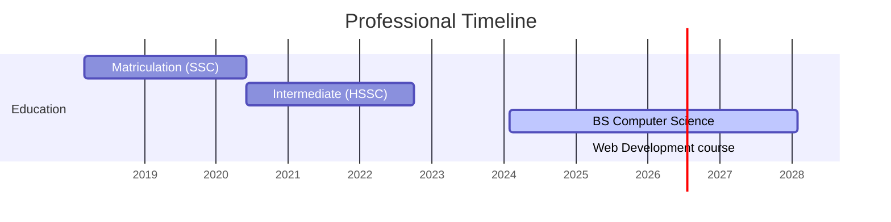

# 
Hi! 👋 I am Ubaid Ahmad 

## 
Web Development Student | JavaScript Intern |

### About Me 
Hello, I’m a Web Development student pursuing a BS in Computer Science. I build clean, responsive, user-friendly websites.
I enjoy turning ideas into digital experiences and continuously improving my skills. My goal is to become a skilled full-stack developer and contribute to meaningful projects.

### Skills 💻
 
 
 
 
 
 

### 📈 GitHub Analytics
<!-- Enhanced Stats Cards Layout -->

  

---
### GitHub Stats 📊

  

## 📜 **Career Timeline**

### 📫 Let's Connect
<!-- Animated Social Badges -->

  
  
  
  

  
  

---

