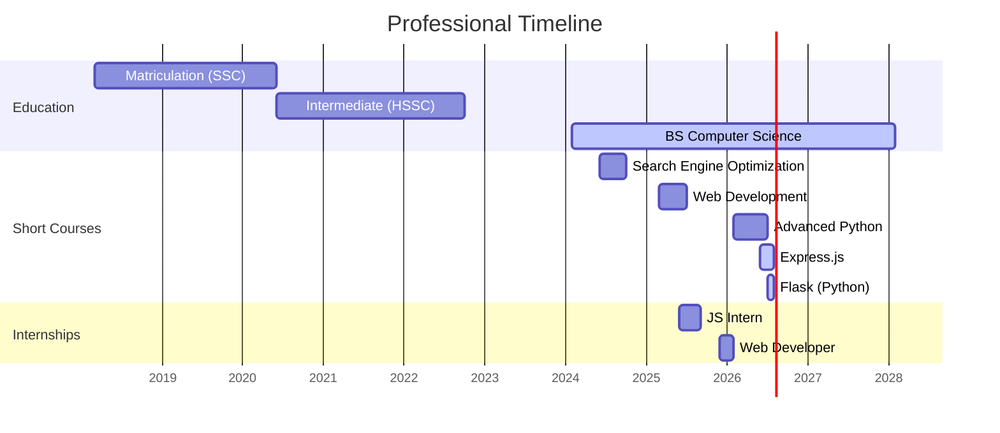

<!-- ================================================================== -->
<!--  UBAID AHMAD — GITHUB PROFILE README                                -->
<!-- ================================================================== -->

 

  

 

<!-- ================================================================== -->
<!--  ABOUT                                                              -->
<!-- ================================================================== -->

##  About Me

I'm a **Web Development** student pursuing a **BS in Computer Science**, focused on building clean, responsive, and user-friendly websites.

I enjoy turning ideas into real digital experiences and constantly sharpening my craft. My goal is to grow into a well-rounded **full-stack developer** and contribute to products that actually matter.

- 🎓 Currently pursuing **BS Computer Science** (2024 – 2028)
- 🌱 Currently strengthening **Advanced Python**, **Express.js**, and **Flask**
- 💬 Ask me about **HTML, CSS, JavaScript, Node.js, Express.js**
- 📫 Reach me at **ahmadubaidedu@gmail.com**

 

---

<!-- ================================================================== -->
<!--  TECH STACK                                                         -->
<!-- ================================================================== -->

##  Tech Stack

<table align="center">
<tr>
<td align="center" width="33%">

**Languages**
 

</td>
<td align="center" width="33%">

**Frontend**
 

</td>
<td align="center" width="33%">

**Backend & Frameworks**
 

</td>
</tr>
</table>

---

<!-- ================================================================== -->
<!--  GITHUB STATISTICS                                                  -->
<!-- ================================================================== -->

##  GitHub Analytics

 

 

---

<!-- ================================================================== -->
<!--  CAREER TIMELINE & CURRENT LEARNING                                 -->
<!-- ================================================================== -->

##  Career Timeline

```mermaid
gantt
    title Professional Timeline
    dateFormat  YYYY-MM
    axisFormat  %Y

    section Education
    Matriculation (SSC)      :a1, 2018-03, 2020-06
    Intermediate (HSSC)      :a2, after a1, 2022-10
    BS Computer Science      :active, a3, 2024-02, 2028-02

    section Short Courses
    Search Engine Optimization :a4, 2024-06, 2024-10
    Web Development             :a5, 2025-03, 2025-07
    Advanced Python              :a6, 2026-02, 2026-07
    Express.js                   :active, a7, 2026-06, 2026-08
    Flask (Python)                :active, a8, 2026-07, 2026-08

    section Internships
    JS Intern            :a9, 2025-06, 2025-09
    Web Developer         :a10, 2025-12, 2026-02
```

**Currently learning:**   

---

<!-- ================================================================== -->
<!--  CONTACT                                                            -->
<!-- ================================================================== -->

##  Let's Connect

I'm always open to interesting conversations, collaborations, and opportunities.

---

Thanks for stopping by — always building, always learning. 🚀

