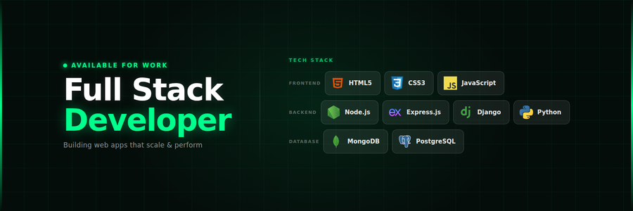

<!--  -->
<!-- Full Banner Container with Gradient -->

  <table>
    <tr>
      <td align="center" style="padding: 0; width: 100%; height: 200px; background: linear-gradient(135deg, #0c0c1d 0%, #1a1a3e 25%, #2d1b69 50%, #1a1a3e 75%, #0c0c1d 100%); border-radius: 20px; box-shadow: 0 15px 50px rgba(0,0,0,0.5);">
        

          
        

      </td>
    </tr>
  </table>

### About Me 
Hello, I’m a Web Development student pursuing a BS in Computer Science. I build clean, responsive, user-friendly websites.
I enjoy turning ideas into digital experiences and continuously improving my skills. My goal is to become a skilled full-stack developer and contribute to meaningful projects.

### Skills 💻

 
   
   
   
   
  
  
   
  
  

   

 

### 📈 GitHub Analytics

  <!-- Stats Cards -->
  <!--  -->
    
   
   
   
  <!-- GitHub Streak -->
  
  <!--  -->

---
<!-- 
### GitHub Stats 📊

  

-->

## 📜 **Career Timeline**

```mermaid
gantt
    title Professional Timeline
    dateFormat  YYYY-MM
    axisFormat %Y
    
    section Education
    Matriculation (SSC) :a1, 2018-03, 2020-06
    Intermediate (HSSC) :a2, after a1, 2022-10
    BS Computer Science :active, a3, 2024-02, 2028-02
    

    section Short-Courses
    Search Engine Optimization:a4, 2024-06,2024-10
    Web Development :a5, 2025-03,2025-07
    Advance Python         :a6, 2026-02,2026-07
    ExpressJS              :active, 2026-06,2026-08
    Flask python          :active, 2026-07,2026-08
    

    section Internship
    Js-intern  :a7,2025-06,2025-09
    Web-Developer :a8, 2025-12, 2026-02

    
```

### 📫 Let's Connect
<!-- Animated Social Badges -->

 

  
  
 

Gmail : ahmadubaidedu@gmail.com

---

