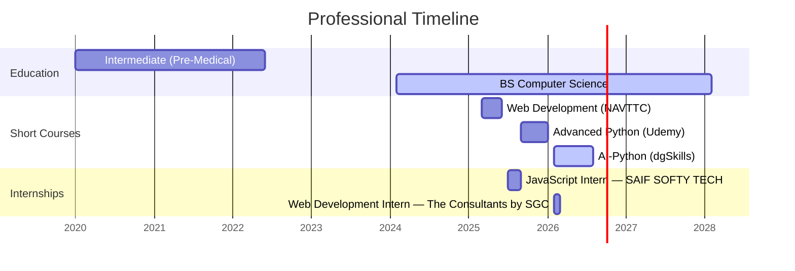

<!-- ================================================================== -->
<!--  UBAID AHMAD — GITHUB PROFILE README                                -->
<!-- ================================================================== -->

 

 

<!-- ================================================================== -->
<!--  ABOUT                                                              -->
<!-- ================================================================== -->

##  About Me

I'm a **Computer Science** student focused on **backend development** and **application security**. I build full-stack Flask applications with proper authentication, data modeling, and secure-by-design practices — and I'm currently deepening my **data structures & algorithms** and **AppSec fundamentals** ahead of a security-engineering-focused internship search.

- 🎓 BS Computer Science, Sir Syed CASE Institute of Technology, Islamabad (2024 – Present) — 6th Semester, CGPA 3.55/4.0
- 🔐 Currently strengthening **Application Security Fundamentals** and **DSA**
- 🛠️ Building with **Flask, Flask-SQLAlchemy, Flask-Login, PostgreSQL**
- 💬 Ask me about **Python, Flask, Secure Authentication Design, JavaScript, C++**
- 📫 Reach me at **ahmadubaidedu@gmail.com**
- 🌐 Portfolio: **ahmadubaid.vercel.app**

 

---

<!-- ================================================================== -->
<!--  TECH STACK                                                         -->
<!-- ================================================================== -->

##  Tech Stack

<table align="center">
<tr>
<td align="center" width="33%">

**Languages**
 

</td>
<td align="center" width="33%">

**Web & Backend**
 

</td>
<td align="center" width="33%">

**Core Concepts**
 

</td>
</tr>
</table>

---

<!-- ================================================================== -->
<!--  GITHUB STATISTICS                                                  -->
<!-- ================================================================== -->

##  GitHub Analytics

 

<!-- ================================================================== -->
<!--  CAREER TIMELINE & CURRENT LEARNING                                 -->
<!-- ================================================================== -->

##  Career Timeline

```mermaid
gantt
    title Professional Timeline
    dateFormat  YYYY-MM
    axisFormat  %Y

    section Education
    Intermediate (Pre-Medical) :a1, 2020-01, 2022-06
    BS Computer Science         :active, a2, 2024-02, 2028-02

    section Short Courses
    Web Development (NAVTTC)   :a3, 2025-03, 2025-06
    Advanced Python (Udemy)     :a4, 2025-09, 2026-01
    AI-Python (dgSkills)         :active, a5, 2026-02, 2026-08

    section Internships
    JavaScript Intern — SAIF SOFTY TECH :a6, 2025-07, 2025-09
    Web Development Intern — The Consultants by SGC :a7, 2026-02, 2026-03
```

**Currently learning:**   

---

<!-- ================================================================== -->
<!--  CONTACT                                                            -->
<!-- ================================================================== -->

##  Let's Connect

I'm always open to interesting conversations, collaborations, and internship opportunities in backend development and application security.

---

Thanks for stopping by — always building, always learning. 🚀

